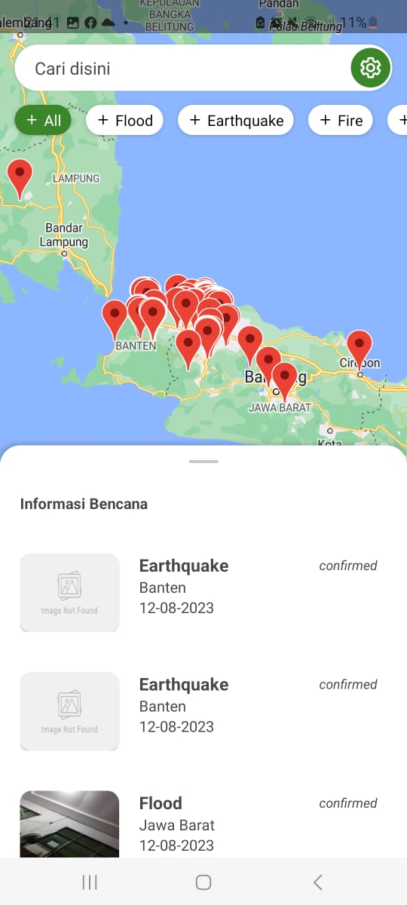
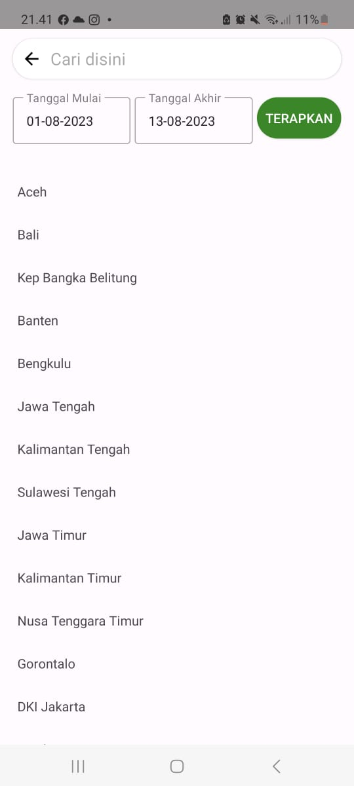
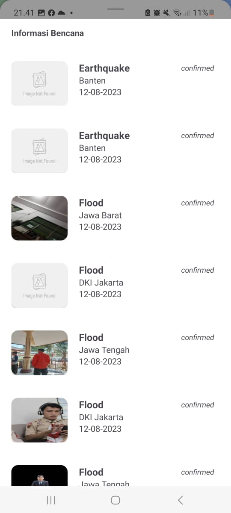
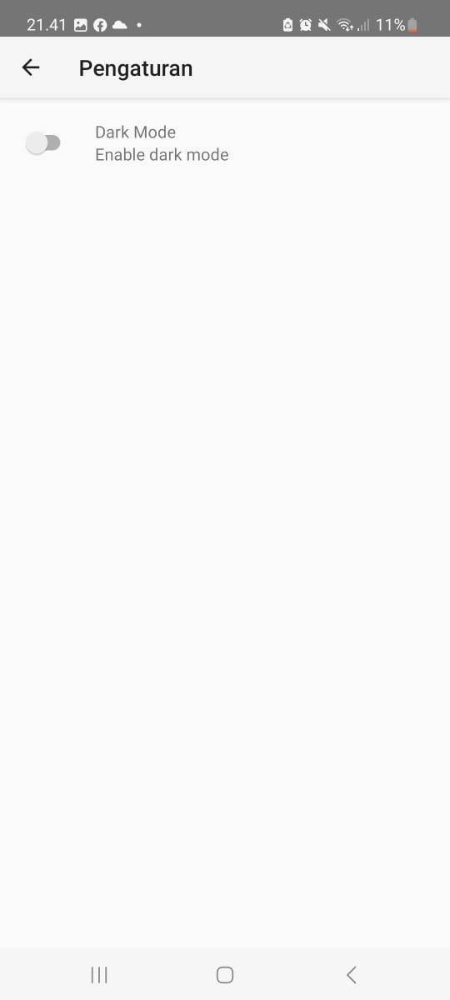

# Disaster App
The Disaster App is an application that helps users monitor various natural disasters that have occurred in Indonesia, such as floods, earthquakes, fires, haze, strong winds, and volcanic activity. This application offers real-time information about these disasters, so that users can know the latest data. Apart from that, this app also has notification preferences. If the notification preference is activated, users will get timely notifications about flood-affected areas in Jakarta, by presenting flood status in real-time.

## Features
- List disaster in x period
- Filterable List (flood, earthquake, fire, haze, volcano, etc)
- Filter based on area 
- Show disaster on Map (use Google Maps)
- Notification Alert based on water level
- Support light/dark theme
- Animation Loading

## Dependencies
The Disaster App application was built using:
|Name| Version |
|--|--|
| Hilt | 2.43.2 |
| Lifecycle | 2.6.1 |
| Datastore Preferences | 1.0.0 |
| Retrofit 2 | 2.9.0 |
| Gson | 2.9.0 |
| Coroutines | 1.6.4 |
| Lottie | 6.1.0 |

## API
API: https://docs.petabencana.id/routes/pemantauan-tma 

## Getting Started
### Clone Project
To start the project, clone the project using the following command:
```
git clone https://github.com/GG-3-0-Mobile-Engineering/ME14-DisasterApp-GG3MEUP0152-IzazDhiyaUlhaq.git
```

### Set Up Google Maps API Key
Before running the application, you need to get Google Maps API Key from [here](https://developers.google.com/maps/documentation/android-sdk/get-api-key).
Add the Google Maps API Key and API Disaster Map URL to the project's local.properties file.
```
MAPS_API_KEY={ADD_YOUR_API_KEY}
```

## Screenshots
     

## APK Installation
[Download Disaster App](https://drive.google.com/file/d/19p3066fjrMu2yBnZvhw1kRLT3XAthSiI/view?usp=sharing)

## Instrument Testing
[Youtube](https://youtu.be/46KFl-pKdbM)